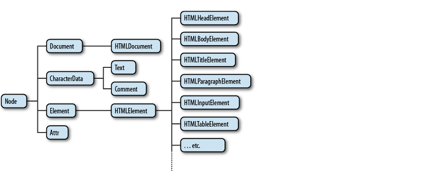

# DOM을 깨우치다

- 코디 린들리 지음 / 안재우 옮김
- 해당 저서를 읽고 주요 내용을 정리하는 저장소


브라우저가 페이지를 렌더링하려면 먼저 DOM 및 CSSSOM 트리를 생성해야 한다.

**브라우저에 의해 문서가 Parse 되는 과정**

- 바이트 -> 문자 -> 토큰 -> 노드 -> 객체 모델 (DOM/CSSOM)
- HTML 마크업은 DOM, CSS 마크업은 CSSOM으로 변환되는 것이다.
- DOM과 CSSOM은 서로 독립적인 데이터 구조이다.

아래의 HTML 문서는 다음의 과정을 거쳐 DOM으로 형성된다.

```html
<!DOCTYPE html>
<html>
  <head>
    <meta name="viewport" content="width=device-width,initial-scale=1" />
    <link href="style.css" rel="stylesheet" />
    <title>Critical Path</title>
  </head>
  <body>
    <p>Hello <span>web performance</span> students!</p>
    <div></div>
  </body>
</html>
```


1. **변환** : 브라우저는 서버에서 HTML의 원시 바이트를 읽고 지정된 파일 인코딩(예 : UTF-8)에 따라 개별 문자로 변환한다.
2. **토큰화** : 브라우저는 W3C HTML5 표준에 따라서 변환된 문자를 의미 있는 단위(예 : `"<html>"`, `"<body>"`)로 나누고 고유한 의미를 갖는 토큰으로 변환한다.
3. **Lexing** : 변환된 토큰은 프로퍼티와 메서드를 갖는 객체로 변환된다.
4. **DOM 형성** : 객체로 변환되기 전 HTML 파일은 들여쓰기를 통해 시각적으로 태그 간의 계층 구조를 표현했다. 하지만 객체 형태로 HTML 파일이 변환됨에 따라서 해당 계층 간의 구조를 Tree 자료 구조로 표현한다.


## DOM

- DOM은 자바스크립트 Node 객체의 계층화된 트리이다.
- 브라우저는 HTML 코드를 해석해서 트리 형태로 구조화된 노드들을 가지고 있는 문서(DOM)을 생성한다.
- DOM을 객체라는 동물이 살고 있는 생태계 환경에 비유해서 생각했다.

## DOM 목적

- JavaScript를 사용해서 각 요소들을 핸들링하기 위한 인터페이스를 제공하는 것이다. (DOM API)
  - document 객체는 DOM 트리의 진입점 역할을 한다. document 객체를 통해 DOM에서 제공하는 인터페이스로 각 요소를 interactive하도록 만들 수 있다.

## DOM 트리

- Node 객체로 이루어진 트리 구조의 형태를 DOM 트리라고 한다.

## Node



- Node 객체는 DOM에서 시조와 같은 역할을 한다.
- 즉, 모든 DOM 객체는 Node로부터 속성과 메서드를 상속 받는다.
  - DOM에서는 Node에서 제공하는 모든 [프로퍼티](https://developer.mozilla.org/ko/docs/Web/API/Node)를 사용할 수 있다.

## DOM 상속 관계

객체 상속의 시작은 최상위 조상인 Object.prototype로부터 시작된다.

```js
Object.prototype;
console.dir(EventTarget); // __proto__: Object
console.dir(Node); // __proto__: EventTarget
console.dir(Document); // __proto__: Node
```

- EventTarget 객체는 Object 객체를 상속 받아 확장한다.
- Node 객체는 EventTarget 객체를 상속 받아 확장한다.
- Document 객체는 Node 객체를 상속 받아 확장한다.

cf. Object < EventTarget < Node < Element < HTMLElement < HTMLAnchorElement
cf. Object < EventTarget < Node < Document < HTMLDocument
